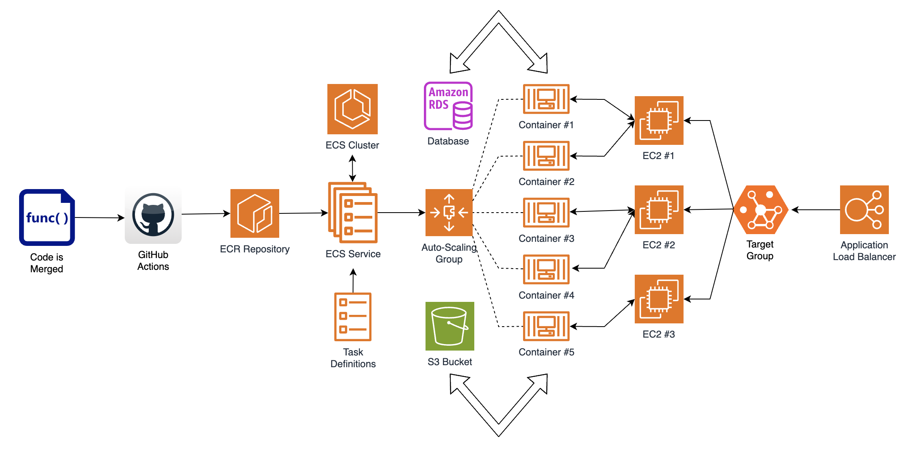
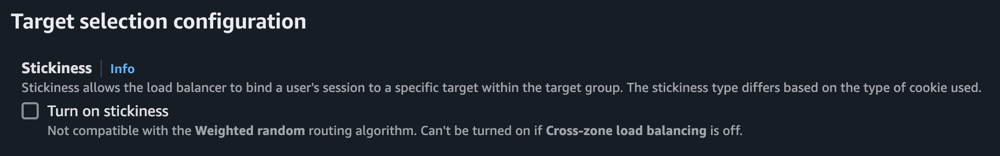

# AudioBook: A tiny voice recorder app for personal use

This repository is the deliverable of the full-stack assignment, linked with the recruitment process for the role of  [AWS Full Stack Lead Developer](https://apply.workable.com/expedite-commerce/j/3FC3A6AEB0/) role in **Expedite Commerce**. We have to build a voice recorder app in which the users will be able to record any audio seamlessly. They should also be able to play them anytime in the future.

## 1. Source Code:

To run this dockerized setup in your local environment, you have to:

1. clone this repository and move inside it in your terminal.

```
git clone git@github.com:arkachego/audiobook.git
```
2. ensure that Docker is installed and the **Docker Daemon Service** is running.

```
docker --version
```

To launch the dockerized environment **for the first time**, please execute:

```
yarn setup && yarn build && yarn start && yarn migrate && yarn stop && yarn start
```

Congratulations! **AudioBook** is now hosted on http://localhost:5000. The server is running in http://localhost:3000. For subsequent turn on/off requirements, just use `yarn start` and `yarn stop` commands.

Explanations of the commands are listed below:

| Command      | Description                                                                                    |
| ------------ | ---------------------------------------------------------------------------------------------- |
| yarn setup   | It is used to install the necessary dependencies for both the server and client apps.          |
| yarn build   | It is used to create the docker images from both the apps.                                     |
| yarn start   | It is used to create the containers from the images and finally to run them.                   |
| yarn stop    | It is used to stop all the running containers under this dockerized environment.               |
| yarn ps      | It is used to list all the running containers in the terminal.                                 |
| yarn logs    | It is used to display the logs of a service when the dockerized setup is running.              |
| yarn migrate | It is used to create necessary tables and relations in the underlying **PostgreSQL** database. |

> To get the logs for the server module, we can execute `yarn logs server`.

## 2. AWS Deployment Strategy

The deployment strategies for both the client and the server app have been described below.

### Client App

Deployment of the front-end app can be achieved through **AWS Amplify** service. We can create an **AWS Amplify** app linking the **GitHub** repository and mapping the correct branch to deploy in the **AWS** account in the required region. Upon deployment, **AWS Amplify** provides an **URL** to access the app which has the following pattern:

```
https://<branch_name>.<random_14_chars>.amplifyapp.com
```
If we want to add some custom domains, that provision is also available in **AWS Amplify** under the **Hosting > Custom Domains** page. We have to do this job in all the **AWS** accounts containing the `develop`, `staging` and `production` environments.

In addition to that, we have to include the **URL** of this app in the list of **Allowed Origins** of the **CORS** settings in the server app to allow the traffic from here. We need to set the correct environment variable of the server app to achieve it.

As **AWS Amplify** listens the changes in the codebase, whenever there is a change in the linked branch of the client app in **GitHub**, corresponding linked app in **AWS Amplify** will be deployed with the updated codebase automatically.

### Server App

Unlike the client app, the automatic deployment process of the server app involves some more setup in the **AWS** cloud. The entire architecture of the server has been depicted in the diagram below.



We have an **ECS** cluster which contains our server app as a service. The **ECS** service is linked with **Task Definitions**, which contain the environment variables for our servers.

Internally, one or more **EC2** instances are created based on the horizontal scaling settings we have provided in the cluster utilising the **Auto-Scaling Group** mechanism. The service tasks are deployed in multiple containers inside the **EC2** instances.

On the other side, the **Application Load Balancer** receives the requests from the client app and forwards them to the linked **Target Group**. The linked **Target Group** consists of the **EC2** instances, created by the **ECS** cluster.

#### Enable Stickiness

The socket connection between the server and the client is a stateful session which must be maintained during the entire recording phase. Hence, while implementing the horizontal scalability of our server app, we have to enable **Stickiness** in the underlying **Target Group** of the **Application Load Balancer**.



In this way, we ensure that a socket is always connected to that specific container from where it has achieved the connection throughout it's entire lifetime. If the request volume increases, horizontal auto-scaling takes place automatically without disrupting already existing connections sticked to the corresponding containers.

>  This settings is not available while creating the **Target Group**. It can be done after the creation and can be found in the **Attributes** menu under **Target Selection Configuration** settings.

#### Additional Services

In the implementation, we are utilising a **PostgreSQL** database to store the user details and the metadata of the records. We have to link an **AWS RDS** instance to our server to serve this purpose.

We are storing the recording files in our local system inside the `/public` folder, which is being statically served by the **Express** app. We must implement a new function to store them in an **AWS S3** bucket for the environments we deploy in the cloud.

## 3. Documentation

### Front-End Client

It was told to use either [Vue.js](https://vuejs.org/) or any other preferred front-end framework in the requirement. I used [React.js](https://react.dev/) under [Next.js](https://nextjs.org/) as the front-end frameworks as I haven't worked with [Vue.js](https://vuejs.org/) yet. Additionally, I used [Shadcn UI](https://ui.shadcn.com/) and [TailwindCSS](https://tailwindcss.com/) for components and styling. Although a minimal UI is asked for, mine is a bit aesthetically pleasing. I have integrated [Aceternity UI](https://ui.aceternity.com/) on the front-end to do so!

The front-end app consists of 3 routes:

1. `/onboard`: This page contains a single input field where the user needs to enter his/her name.
2. `/records`: This page contains all the records the user has made till now sorted in decending order of the date of creation. The latest one comes first.
3. `/recorder`: This page is the audio recorder engine which communicates with the server using socket connections.

I have divided the recording and playback functionalities among the `/records` and `/recorder` pages respectively. This has been done to implement a **Separation of Concern** between two specific actions over the whole functionality.

The `/recorder` page is designed in such a way that, when the user lands in here, the socket gets connected automatically. Whenever, user moves away from this page and the component is getting unmounted, the existing socket is being disconnected. As a result, the scope of socket connection is only inside the `/recorder` page. The other two pages are relying on one-way **REST API** requests only.

### Back-End Server

For the back-end I used [Node.js](https://nodejs.org/en) and [Express.js](https://expressjs.com/). Also there is a [Socket.IO](https://socket.io/) implementation to stream the audio from the client to the server.  Though we have two different apps for the server and client, I'm submitting only one [GitHub](https://github.com/arkachego/audiobook) repository containing both of them. Actually, this repository is the parent dockerized environment to run both the apps together in any local environment where [Docker](https://www.docker.com/) is running. Also there is a [PostgreSQL](https://www.postgresql.org/) database behind the server app. A separate service is listed under the `compose.yaml` file for it in this dockerized setup.

Whenever the user lands into the `/recorder` page, the client app sends the `connection` event to the server to establish the socket connection. When the user initiates the recording, the client app streams the audio through the `append-recording` event. When the user clicks on the stop button, the client app sends the `stop-recording` event to the server. The server then saves the file and reverts a `recording-saved` event to the client app.