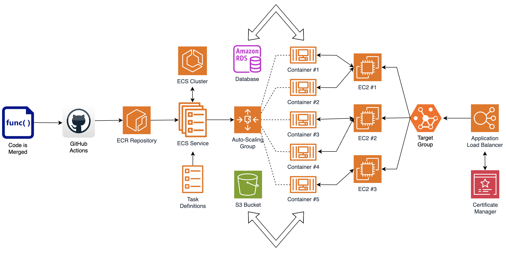

# AudioBook: A tiny voice recorder app for personal use

This repository is the deliverable of the full-stack assignment, linked with the recruitment process for the role of  [AWS Full Stack Lead Developer](https://apply.workable.com/expedite-commerce/j/3FC3A6AEB0/) role in **Expedite Commerce**. We have to build a voice recorder app in which the users will be able to record any audio seamlessly. They should also be able to play them anytime in the future.

### How to run?

To run this dockerized setup in your local environment, you have to:

1. clone this repository and move inside it in your terminal.
2. ensure that the Docker daemon service is running.

To launch the dockerized environment **for the first time**, please execute:

```
yarn setup && yarn build && yarn start && yarn migrate && yarn stop && yarn start
```

Congratulations! **AudioBook** is now hosted on http://localhost:5000. The server is running in http://localhost:3000. For subsequent turn on/off requirements, just use `yarn start` and `yarn stop` commands.

Explanations of the commands are listed below:

| Command      | Description                                                                                    |
| ------------ | ---------------------------------------------------------------------------------------------- |
| yarn setup   | It is used to install the necessary dependencies for both the server and client apps.          |
| yarn build   | It is used to create the docker images from both the apps.                                     |
| yarn start   | It is used to create the containers from the images and finally to run them.                   |
| yarn stop    | It is used to stop all the running containers under this dockerized environment.               |
| yarn ps      | It is used to list all the running containers in the terminal.                                 |
| yarn logs    | It is used to display the logs of a service when the dockerized setup is running.              |
| yarn migrate | It is used to create necessary tables and relations in the underlying **PostgreSQL** database. |

> To get the logs for the server module, we can execute `yarn logs server`.

### Front-End Client

It was told to use either [Vue.js](https://vuejs.org/) or any other preferred front-end framework in the requirement. I used [React.js](https://react.dev/) under [Next.js](https://nextjs.org/) as the front-end frameworks as I haven't worked with [Vue.js](https://vuejs.org/) yet. Additionally, I used [Shadcn UI](https://ui.shadcn.com/) and [TailwindCSS](https://tailwindcss.com/) for components and styling. Although a minimal UI is asked for, mine is a bit aesthetically pleasing. I have integrated [Aceternity UI](https://ui.aceternity.com/) on the front-end to do so!

#### AWS Deployment Strategy

Deployment of the front-end app is super easy through **AWS Amplify**. We can create an **AWS Amplify** app linking the **GitHub** repository and mapping the correct branch to deploy in the **AWS** account in the required region. Upon deployment, **AWS Amplify** provides an **URL** to access the app which has the following pattern:

```
https://<branch_name>.<random_14_chars>.amplifyapp.com
```
If we want to add some custom domains, that provision is also available in **AWS Amplify** under the **Hosting > Custom Domains** page. We have to do this job in all the **AWS** accounts containing the `develop`, `staging` and `production` environments. Upon doing this, whenever there is a change in the linked branch of the client app in **GitHub**, corresponding linked app in **AWS Amplify** will be deployed with the updated codebase automatically. In addition to that, we have to include the live **URL** of this app into the **Origin** field of the **CORS** settings in the server app to allow traffic from there. We need to set the correct environment variable of the server app to achieve it.

### Back-End Server

For the back-end I used [Node.js](https://nodejs.org/en) and [Express.js](https://expressjs.com/). Also there is a [Socket.IO](https://socket.io/) implementation to stream the audio from the client to the server.  Though we have two different apps for the server and client, I'm submitting only one [GitHub](https://github.com/arkachego/audiobook) repository containing both of them. Actually, this repository is the parent dockerized environment to run both the apps together in any local environment where [Docker](https://www.docker.com/) is running. Also there is a [PostgreSQL](https://www.postgresql.org/) database behind the server app. A separate service is listed under the `compose.yaml` file for it in this dockerized setup.

### AWS Deployment Strategy

Unlike the client app, the automatic deployment process of the server app involves some more setup in the AWS cloud. Please follow the diagram below:



### Additional Thoughts

In real situation, the server and client apps must reside in two separate repositories and the dockerized environment should be another different one. In this setup, we need to write more scripts to clone the linked repositories, installing the dependencies of the same, building them and finally make them live in the dockerized environment. 

> This full-stack assignment is undoubedly the best one among all the others I have solved till date!
